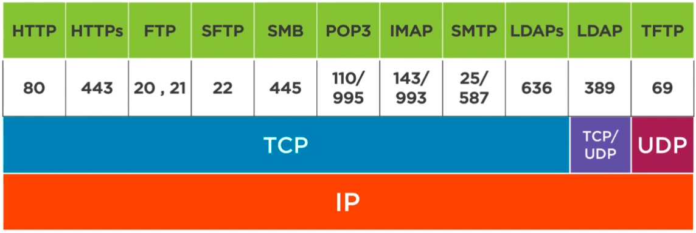
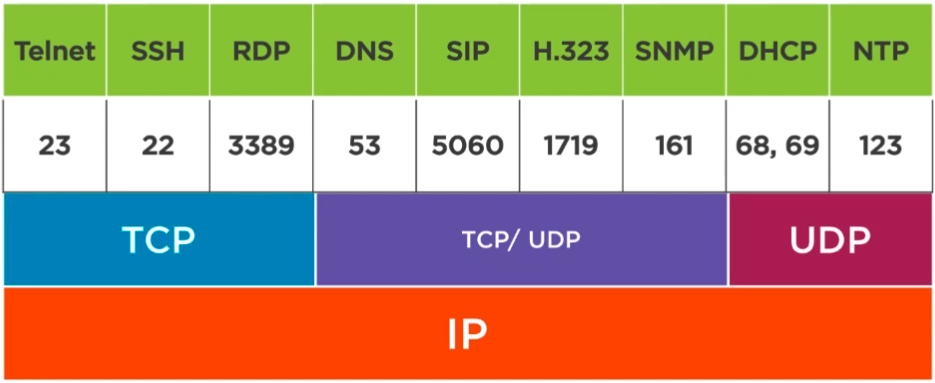

# TCP and UDP

## Transport Layer Protocols (Layer 4)

### Transmission Control Protocol (TCP)

- To communicate from client to server, a session needs to be started for specialized communications
    - Think of all the steps needed to make a phone call, how we converse once on the call, and how to end the call
    - Establish session, acknowledge info was received or not, method to end the session

- The 3-Way Handshake
    1. SYN (synchronize)
        - Client sends a message to the server
    2. SYN-ACK 
        - Server sends a response to the client acknowledging the SYN message was received
    3. ACK
        - Client responds to the server that it received the SYN-ACK and is now ready to communicate
    - Once the 3 way message (Layer 4) is complete and the connection is established we can now request data from the server (Layer 7) and it will respond.
        - Layer 4: Establish the session
        - Layer 7: Transfer the website itself
    - Client or server can send messages if parts of the message did not come through

- The 4-Way Disconnect
    1. FIN (server)
    2. FIN-ACK (client)
    3. FIN (client)
    4. FIN-ACK (server)
    - May no longer send any Layer 7 requests after this is completed
    - Shuts down the session completely

- TCP Reset
    - RST is sent and immediately ends the session
        - This could even come from a firewall

### User Datagram Protocol (UDP)

- No session setup!
    - Wrap up an application layer message, like DNS, and send to the Server
    - The server responds with what the client requested
    - More like using a walkie-talkie, you might be addressing a person, but you don't know if they're there
- No reliable communication
- No sequence numbers or acknowledge numbers to verify the data sent was received
- Very efficient for very small data transfers
    - Perfect for DNS queries

### Transport Layer Addressing - Port Numbers

- Ports run from 0-65535
- Ports typically identify an application layer protocol used
- Well Known/Registered (server ports) vs. Ephemeral Ports (client ports)
    - Well Known: 0-1023
    - Registered: 1024-49151
        - Used for custom applications (IBM, H.323, etc.)
    - Ephemeral: 49152-65535
- What happens?
    - Client source port: 49152
    - Service destination port: 23
    - For example, when a client sends a SYN message to a Telnet server
    - Source and destination will be included within the **TCP Header**

### Protocol Dependencies

- Layer 7 protocols have a Layer 4 port number assigned

